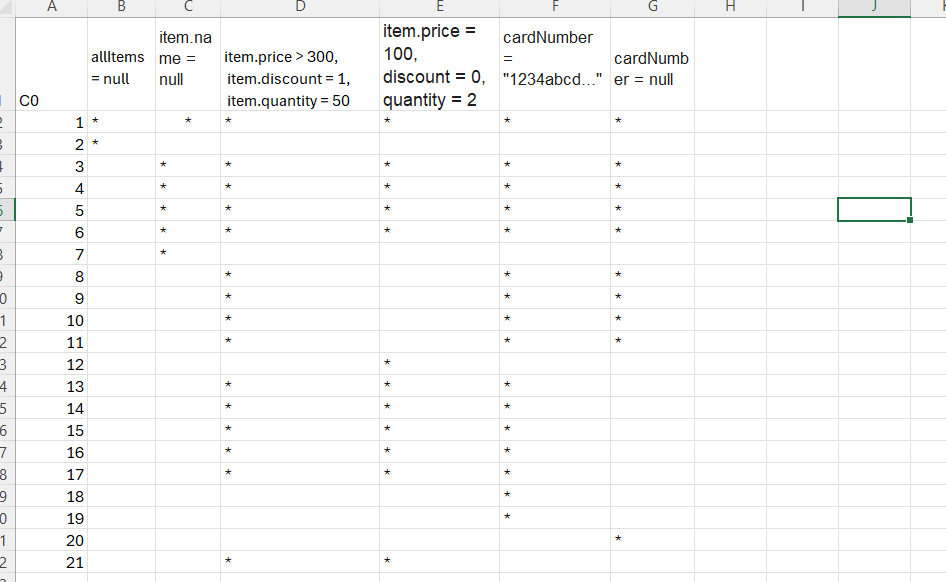
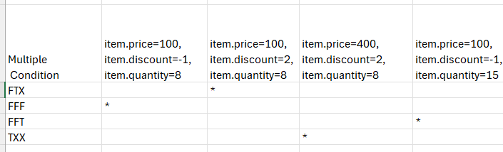
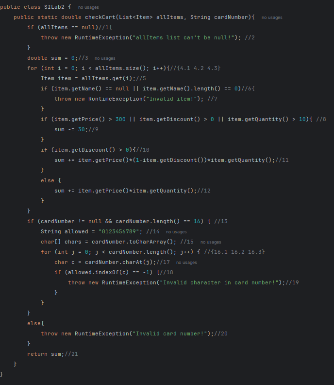

# SI_2025_lab2_233131
Teodora Spasikj 233131

За овој код цикломатската комплексност изнесува 9 т.е претставува број на региони.Вкупниот број го добив со следната формула број на ребра - број на јазлии+2

C0 - test case-ови

Ќе ни бидат потребни минимум 6 test cases-ови имајќи за цел секоја линија да биде опфатена

Тest case 1 - allItems е null па затоа ќе се фрли исклучок: "allItems list can't be null!"

Тest case 2 - item.name е null исто и тука ќе се фрли исклучок: "Invalid item!"

Теst case 3 - Условот item.getPrice() > 300 || getDiscount() > 0 || getQuantity() > 10, и discount > 0, sum = -30 + 500*(1-0.2)*20 = -30 + 8000 = 7970

Теst case 4 - Немаат важност условот if(...), и discount = 0

Теst case 5 - cardNumber има карактер (а треба број), "Invalid"

Multiple Condition за if (item.getPrice() > 300 || item.getDiscount() > 0 || item.getQuantity() > 10)

За следниот услов во кој што има логички оператор OR, во сите три случаи ќе биде TRUE освен во едниот случај каде што ќе биде FALSE

