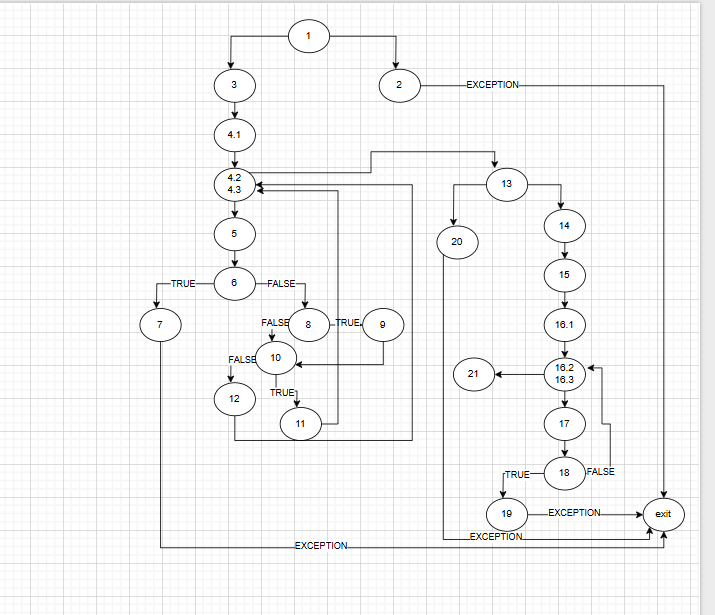

# SI_2025_lab2_233131
Teodora Spasikj 233131

За овој код цикломатската комплексност изнесува 9 т.е претставува број на региони.Вкупниот број го добив со следната формула број на ребра - број на јазлии+2
